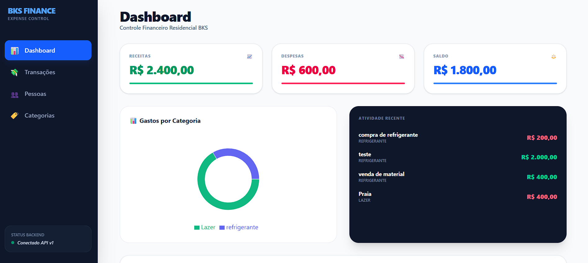
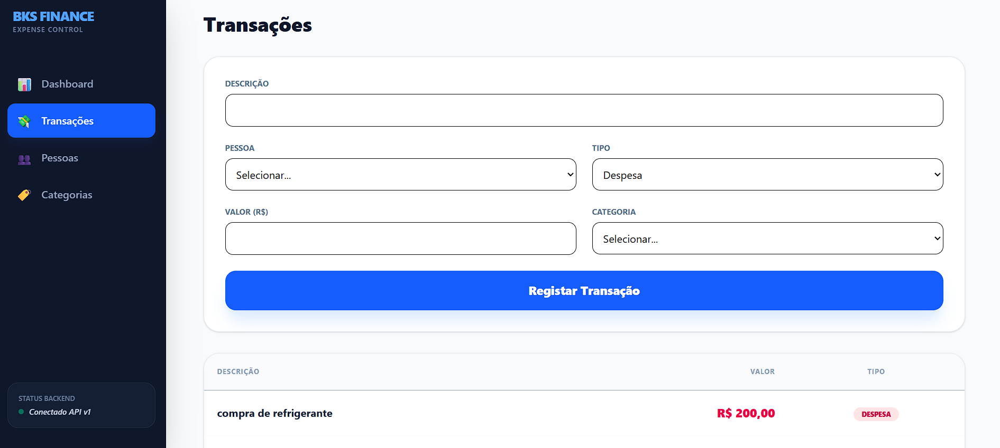
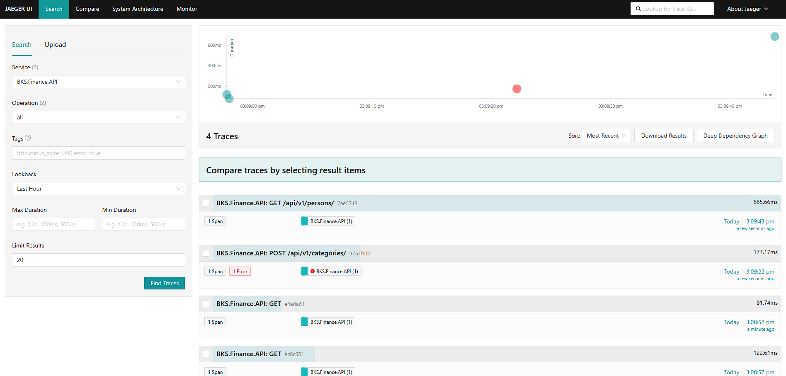

[](https://github.com/bks-sdk/bks-sdk)
[](https://dotnet.microsoft.com/)
[]()
 
 # BKS Finance — Expense Control (Full Stack)

Sistema completo de **Controle de Gastos Residenciais**, composto por um **Backend em .NET 8** e um **Frontend moderno em React + TypeScript**.  
A solução foi projetada com forte foco em **arquitetura limpa**, **boas práticas**, **performance** e **escalabilidade**, refletindo padrões utilizados em ambientes profissionais.

---

## 🖼️ Visual do Sistema (telas principais)

| Dashboard Principal | Gestão de Transações |
|---|---|
|  |  |

---

## 🏗️ Arquitetura do Sistema (C4 Model)

Abaixo, o diagrama de arquitetura seguindo o padrão C4 (Container/Component), demonstrando a segregação entre as camadas de domínio e os adaptadores de infraestrutura.


## 🏗️ Visão Geral da Arquitetura

O sistema é dividido em dois grandes módulos:

- **Backend (API)** — Responsável pelo domínio, regras de negócio e persistência
- **Frontend (Web)** — Interface do usuário, consumo da API e visualização dos dados

Cada módulo segue princípios sólidos de separação de responsabilidades.

---

O core do sistema foi desenvolvido em **.NET 8** focado em desacoplamento total.

### 🧩 Padrões Utilizados
* **Clean Architecture:** Separação clara de Domain, UseCases e Adapters.
* **Mediator Pattern:** Orquestração de comandos e queries via BKS-SDK.
* **Ports & Adapters:** Infraestrutura (PostgreSQL/Dapper) ligada apenas por interfaces.
* **Observabilidade:** Rastreamento distribuído com **OpenTelemetry** e **Jaeger**.

### 🛠️ Tecnologias
* **.NET 8** & **C#**
* **BKS-SDK:** (Mediator, Logging, Tracing Distribuído)
* **Jaeger:** (Coleta de Tracing)
* **Opentelemetry:** (Telemetria e Integração com Jaeger)
* **Dapper:** Performance máxima em consultas SQL.
* **PostgreSQL:** Banco de dados relacional.
* **FluentValidation:** Validação de contratos de entrada.

---

## 📦 Arquitetura do Backend

### Domain-Driven Design, Ports and Adapters e Clean Architecture sendo refletidos no código, de forma a expressar o domínio dentro do projeto.

### Domain (Core)
Camada central do negócio.

- Entidades: `Person`, `Category`, `Transaction`
- Enums e Value Objects
- Interfaces (Ports) de saída
- **Sem dependências externas**

---

### UseCases (Application)
Orquestra a lógica de negócio.

- Padrão **Mediator** (via BKS SDK)
- Commands e Handlers desacoplados
- Validação das regras de negócio

---

### Adapters — Inbound (API)
Camada de entrada da aplicação.

- **Minimal APIs**
- DTOs de request/response
- Mapeadores
- Validação com FluentValidation

---

### Adapters — Outbound (Infrastructure)
Integrações externas.

- Persistência com **Dapper**
- Banco de dados **PostgreSQL**
- Implementação concreta dos repositórios

---

### Configuration
- Injeção de Dependência
- Inicialização do BKS SDK
- Logging e Tracing (OpenTelemetry)

---

## 🛠️ Tecnologias — Backend

- **.NET 8**
- **BKS SDK** (Opentelemetry, Mediator, Logging, Tracing Distribuido)
- **Dapper**
- **PostgreSQL**
- **Polly** (resiliência com retry)
- **FluentValidation**

---

## ⚖️ Regras de Negócio Implementadas

O sistema não é apenas um CRUD, ele contém lógica de domínio rigorosa:

1.  **Restrição de Idade (Compliance):** Menores de 18 anos são impedidos por regra de domínio de registrar **Receitas**. O sistema bloqueia automaticamente a interface e valida no backend.
2.  **Filtro de Finalidade (Contexto):** Categorias são inteligentes. Uma categoria de "Material de Construção" (Despesa) não aparece se o usuário estiver tentando registrar um ganho.
3.  **Integridade Referencial:** Implementado **Cascade Delete**. Ao remover um membro da residência, todo o seu histórico financeiro é saneado para manter a integridade dos relatórios.

---

## 📊 Observabilidade e Tracing

A aplicação utiliza o padrão **OpenTelemetry** através do **BKS-SDK** para exportar dados de telemetria estruturados. Isso permite o rastreamento completo da jornada de uma requisição (Distributed Tracing), desde a entrada na Minimal API até a persistência final no PostgreSQL.

### 🕵️ Rastreamento com Jaeger
Com o suporte ao protocolo **OTLP**, o sistema permite identificar gargalos de performance, falhas em handlers específicos e o tempo exato de execução das queries SQL.

| Visualização de Traces Distribuídos (Jaeger UI) |
|---|
|  |

#### Como visualizar:
1. Certifique-se de que o container do Jaeger está em execução (`port 16686`).
2. Realize transações no Frontend ou via Swagger.
3. Acesse: [http://localhost:16686](http://localhost:16686).
4. Selecione o serviço `BKS.Finance.API` e clique em **Find Traces**.

---

### 🗂️ Vínculo de Categoria

| Purpose | Valor | Descrição |
|------|------|-----------|
| Expense | 0 | Apenas despesas |
| Income | 1 | Apenas receitas |
| Both | 2 | Ambas |

---

### 🧹 Integridade de Dados
- Exclusão de pessoa → **Cascade Delete** das transações
- Garante consistência do banco

---

## 🔄 Fluxo Backend

1. Requisição chega via Minimal API  
2. Validação inbound (FluentValidation)  
3. Envio ao Mediator  
4. Handler aplica regras e persiste dados  
5. Retorno padronizado via `Result<T>`

---

## 🗄️ Modelo de Dados (PostgreSQL)

**persons**
- id (UUID)
- name
- age

**categories**
- id (UUID)
- description
- purpose (int)

**transactions**
- id (UUID)
- description
- value
- type (int)
- category_id
- person_id

Consultas agregadas são feitas diretamente no SQL para **alta performance**.

---

## ▶️ Executando o Backend

### Pré-requisitos
- Docker
- Docker Compose
- .NET SDK 8

### Subir o banco
```bash
docker-compose up -d postgres

```

## ▶️ Executar a API

```bash
dotnet run --project src/Main

```

### Swagger

- http://localhost:5034/swagger

# Frontend — Expense Control Web

Este módulo representa a interface do usuário do sistema.
Foi desenvolvido com React 18, TypeScript e Tailwind CSS v4, mantendo alinhamento total com o domínio exposto pelo backend.

### 🚀 Tecnologias Utilizadas — Frontend

| Tecnologia      | Descrição                      |
| --------------- | ------------------------------ |
| React 18        | Biblioteca base da UI          |
| TypeScript      | Tipagem estática               |
| Vite            | Build tool de alta performance |
| Tailwind CSS v4 | Estilização utilitária         |
| Axios           | Cliente HTTP                   |
| Lucide React    | Biblioteca de ícones           |

### Estrutura de pastas

```text
src/
├── components/   # Componentes reutilizáveis (Buttons, Cards, Inputs)
├── hooks/        # Hooks customizados
├── services/     # Comunicação com a API
├── types/        # Tipos e interfaces globais
├── views/        # Páginas (Dashboard, etc.)
└── App.tsx       # Componente raiz
```


## Configuração do Ambiente

Node.js v18 ou superior

Backend rodando em http://localhost:5034

```bash
npm install
```

## Execução

```bash
npm run dev
```

- http://localhost:5173

## 🛠️ Implementação Atual

### Tipagem (`/types`)
- Interfaces para `Transaction`, `Category` e `Person`
- Espelhamento fiel do domínio do backend

---

### Camada de Serviço (`/services`)
Endpoints consumidos atualmente:

#### Categories
- GET `/api/v1/categories`
- POST `/api/v1/categories`

---

#### Persons
- GET `/api/v1/persons`
- POST `/api/v1/persons`
- DELETE `/api/v1/persons/{id}`

---

#### Transactions & Reports
- GET `/api/v1/transactions`
- POST `/api/v1/transactions`
- GET `/api/v1/reports/totals`

### Interface (UI)

**Dashboard**
- Saldo geral
- Total de entradas e saídas

**TransactionForm**
- Cadastro rápido de movimentações

**SummaryCards**
- Feedback visual imediato

---

## 🚧 Roadmap

- [x] Fase 1 — Dashboard e integração básica
- [X] Fase 2 — Gestão de Pessoas e Categorias
- [X] Fase 3 — Gráficos por categoria (Recharts)
- [X] Fase 4 — Telemetria e tracing Distribuído
- [X] Fase 5 — Validação de regras de negócio


---

## ⚠️ Notas Importantes

- CORS deve permitir a origem `http://localhost:5173`
- URL base da API configurada em `src/services/api.ts`
- Em produção, mover configurações para variáveis de ambiente (`.env`)

---

## 👨‍💻 Autor

**Diego Amorim**  
Engenharia de Software • Desenvolvedor Full-Stack

---

## 👨‍💻 BKS-SDK Créditos

O uso do SDK que foi desenvolvido em conjunto, pelos dois contribuidores

**Luis Fábio**  
Arquiteto de Software

**Diego Amorim**  
Desenvolvedor Full-Stack

- https://github.com/luisfabiosm/bks.sdk

---


